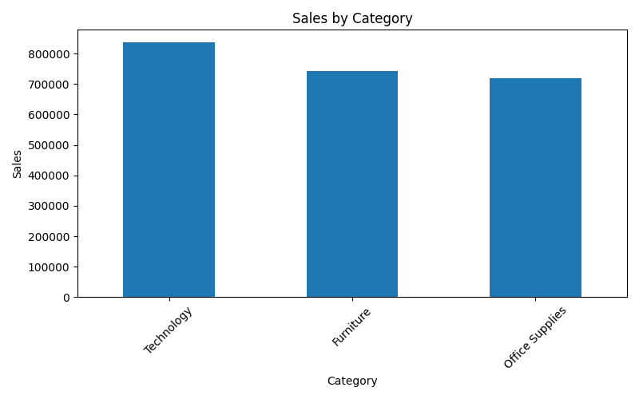
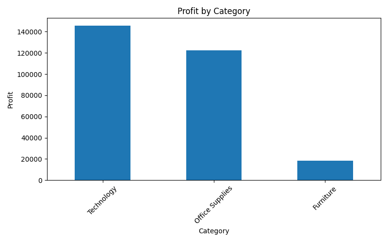
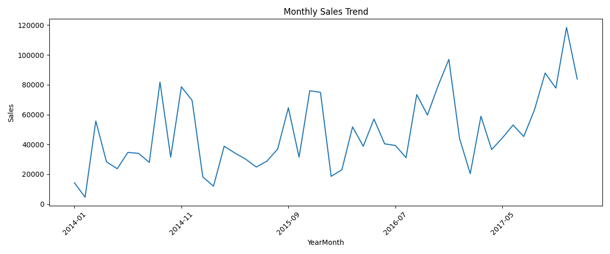

# Excel Data Analysis with Python


This project demonstrates how to automate Excel-based sales data analysis using Python, Pandas, and Matplotlib.

The analysis uses the **Sample Superstore** dataset and generates summary reports, category-level insights, and visualizations automatically.

## Features

- Load and clean sales data from CSV
- Calculate total sales and total profit
- Analyze sales by category
- Analyze profit by category
- Identify top sub-categories by sales
- Generate monthly sales trend
- Export results to Excel and CSV
- Create charts automatically

## Technologies Used

- Python
- Pandas
- Matplotlib
- OpenPyXL

## Project Structure

```text
excel-data-analysis-python
│
├── data
│   └── Sample - Superstore.csv
│
├── output
│   ├── report.xlsx
│   ├── summary.csv
│   ├── sales_by_category.png
│   ├── profit_by_category.png
│   └── monthly_sales_trend.png
│
├── scripts
│   └── analysis.py
│
├── .gitignore
└── README.md

```

## Results

The analysis generated several insights from the sales dataset, including:

- Total sales and total profit across all transactions
- Sales distribution across product categories
- Profit comparison between categories
- Top-performing sub-categories
- Monthly sales trend over time

## Example Visualizations

### Sales by Category



### Profit by Category



### Monthly Sales Trend

